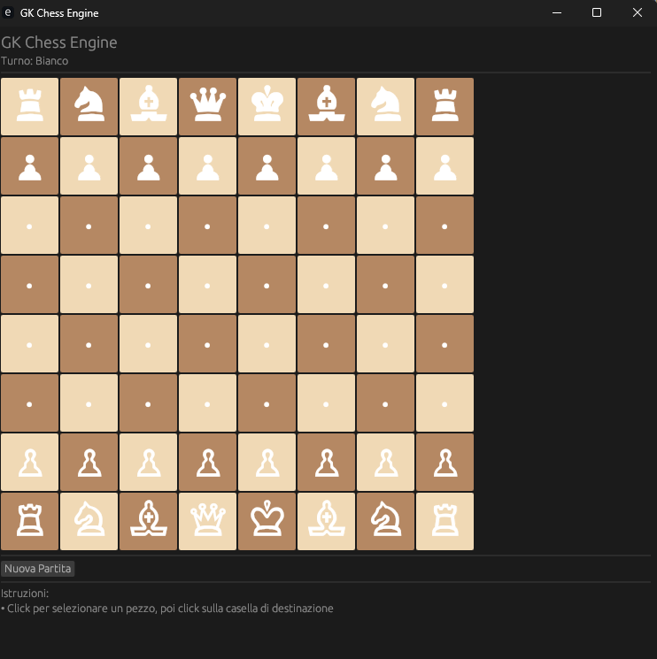

# 🏰 GK Chess Engine

Un motore di scacchi completo con interfaccia grafica, sviluppato in Rust utilizzando `egui` ed `eframe`.


## ✨ Caratteristiche

- ♟️ **Regole complete degli scacchi** implementate correttamente
- 🎯 **Tutti i movimenti speciali**:
  - Arrocco (kingside e queenside)
  - En passant
  - Promozione dei pedoni (automatica a regina)
- 🛡️ **Validazione completa delle mosse**:
  - Controllo che il re non rimanga/vada in scacco
  - Verifica percorsi liberi per pezzi a lungo raggio
  - Validazione turni e catture
- 🎮 **Interfaccia grafica intuitiva**:
  - Visualizzazione con simboli Unicode delle pedine
  - Selezione pezzi con click
  - Evidenziazione mosse valide in verde
  - Indicatore di scacco, scacco matto e stallo
- 🇮🇹 **Interfaccia in italiano**

## 🚀 Come Eseguire

### Prerequisiti

- [Rust](https://www.rust-lang.org/tools/install) (versione 1.70 o superiore)

### Installazione

1. Clona la repository:
```bash
git clone https://github.com/Stormix-dev/gk_chess_engine.git
cd gk_chess_engine
```

2. Esegui il progetto:
```bash
cargo run --release
```

## 🎯 Come Giocare

1. **Seleziona un pezzo**: Clicca sul pezzo che vuoi muovere
2. **Visualizza mosse valide**: Le caselle valide si illumineranno di verde
3. **Muovi il pezzo**: Clicca sulla casella di destinazione
4. **Nuova partita**: Usa il pulsante "Nuova Partita" per ricominciare

## 🏗️ Architettura del Codice

Il progetto è organizzato in moduli logici:

- **`Piece` enum**: Rappresentazione di tutti i pezzi e caselle vuote
- **`Board` struct**: Logica di gioco principale, validazione mosse e stato della scacchiera
- **`GameState` struct**: Tracciamento diritti di arrocco e en passant
- **`ChessApp` struct**: Interfaccia grafica e gestione interazione utente

### Funzionalità Principali
```rust
// Validazione mosse con controllo scacco
fn is_valid_move(&self, from_row, from_col, to_row, to_col) -> bool

// Rilevamento scacco matto
fn is_checkmate(&self) -> bool

// Rilevamento stallo
fn is_stalemate(&self) -> bool

// Validazione arrocco
fn can_castle(&self, ...) -> bool
```

## 🛠️ Tecnologie Utilizzate

- **Rust** - Linguaggio di programmazione
- **eframe** - Framework per applicazioni native
- **egui** - Libreria GUI immediate mode

## 📦 Dipendenze
```toml
[dependencies]
eframe = "0.29"
egui = "0.29"
```

## 🎨 Screenshot



## 📝 Regole Implementate

- ✅ Movimento di tutti i pezzi (pedone, torre, cavallo, alfiere, regina, re)
- ✅ Catture
- ✅ Arrocco (corto e lungo)
- ✅ En passant
- ✅ Promozione pedoni
- ✅ Rilevamento scacco
- ✅ Rilevamento scacco matto
- ✅ Rilevamento stallo
- ✅ Validazione che il re non rimanga in scacco

## 🔮 Sviluppi Futuri

- [ ] Implementazione AI per giocare contro il computer
- [ ] Sistema di notazione algebrica
- [ ] Salvataggio/caricamento partite (formato PGN)
- [ ] Timer per partite blitz/rapide
- [ ] Storia delle mosse con possibilità di undo
- [ ] Analisi posizione e suggerimenti
- [ ] Modalità multiplayer online

## 👨‍💻 Autore

**Gianmarco Simeoni**

## 🙏 Riconoscimenti

- Simboli chess Unicode standard
- Framework `egui` per la GUI reattiva

---

⭐ Se ti piace questo progetto, lascia una stella su GitHub!
